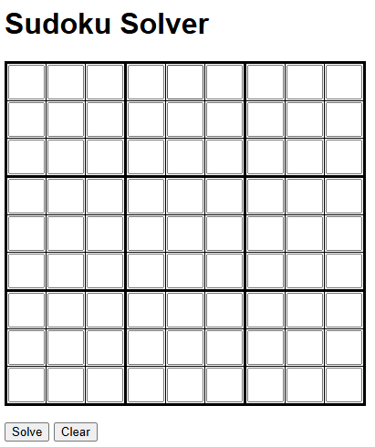
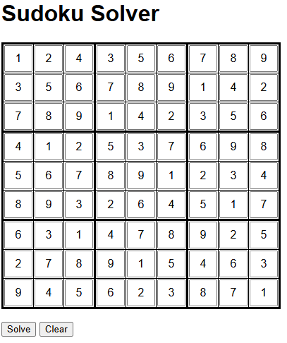
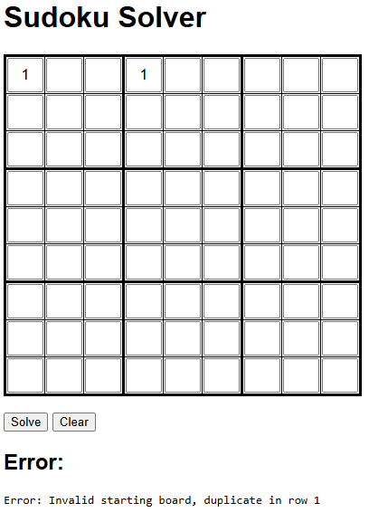

# Sudoku Solver





A web-based Sudoku solver written in Python using Flask. A backtracking algorithm is used for the solver.

## How it works
- The user is prompted to enter a Sudoku puzzle in a 9x9 Sudoku grid
- When the 'Solve' button is pressed, the grid state is stored, then converted to a string format which is passed to the solver
- The solver validates the initial puzzle for row, column, and 3×3 box conflicts. Invalid puzzles fail early with a clear error message, preventing long backtracking on impossible inputs
- If the board is valid but not complete, the solver finds the first empty cell and attempts each number from 1–9
- Each attempt is checked against Sudoku rules (row, column, and 3×3 box)
- Valid numbers are placed and the solver moves on to the next empty cell
- This process is performed recursively. If no valid number can be placed, the algorithm backtracks and tries a different choice
- The solver continues until the puzzle is solved or all possibilities have been exhausted
- If the puzzle is solved, the grid is populated with the completed puzzle. If it is not possible, an error is displayed.
- When the 'Clear' button is pressed, the grid state is converted to empty strings and is returned

## What this project demonstrates
- Algorithmic problem solving using recursive backtracking
- Input validation and early failure handling
- Server-side rendering with Flask and Jinja
- HTTP request/response cycles
- Separation of UI and solver logic
- Automated testing with pytest

## Usage
- Run the solver from the command line:
```bash
python app.py
```
- When prompted, enter digits into the Sudoku grid
- Press the 'Solve' button to attempt to solve the puzzle
- Press the 'Clear' button to reset the grid

## Testing
Pytest is used for testing

Tests cover:
- Parsing and input validation
- Rule enforcement for rows, columns and 3x3 grids
- Solver behaviour for complete valid boards, complete invalid boards, solvable boards, and unsolvable boards.

To run the tests:

```bash
pip install -r requirements.txt
python -m pytest
```

## Requirements
- Python 3.13+
- Flask
- pytest